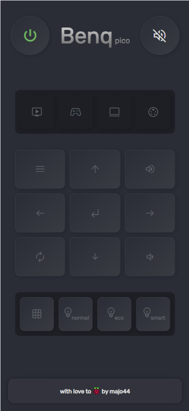
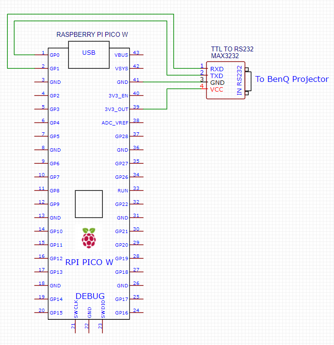

# raspberry-pi-pico-benq
Simple web based remote controller for benq projectors based on raspberry-pi-pico.

## Hardware

* [Rassbery pi pico board](https://www.raspberrypi.com/products/raspberry-pi-pico/)
* TTL to Rs232 (eg MAX3232) board

## Wiring

## Config
Go to [config.py](./config.py) file to see all options, remember to set up the
wifi ssid and password.

## Installation
Copy the `./main.py`, `./config.py`, `lib` and `public` folder to your RPI. 

## Dev
During dev for the RPI I'm using:
* [mpbridge](https://github.com/AmirHmZz/mpbridge) for simple code sync
* [stubs](https://github.com/Josverl/micropython-stubs) for code competition 

## Dependencies
The all dependencies are copied to this repo:
* [utemplate](https://github.com/pfalcon/utemplate) by Paul Sokolovsky
* [microdot](https://github.com/miguelgrinberg/microdot) by Miguel Grinberg
Thanks.
